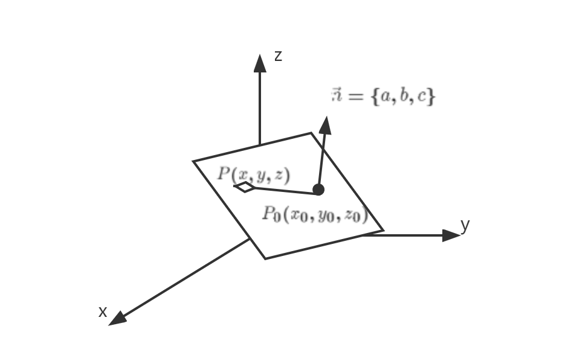

# $\S 1.1$ 线性方程的高斯消元法
引入：

1. 平面的点法式方程

    $P(x,y,z)$ 在平面 $\alpha$ 内，对于 $\forall P\in \alpha$，求 $a$ 所满足的条件

    解：设 $\vec{n}$ 是 $\alpha$ 的一个法向量（$\vec{n}=\{a,b,c\}$），其与 $\alpha$ 的交点为 $P_0=\{x_0,y_0,z_0\}$

    则
    $$
    \begin{align*}
    \vec{PP_0} \perp \vec{n} &\Leftrightarrow \{x-x_0,y-y_0,z-z_0\}\cdot \{a,b,c\}=0\\
    &\Leftrightarrow a(x-x_0)+b(y-y_0)+c(z-z_0)=0
    \end{align*}
    $$

2. 讨论三个平面 $\begin{cases}2x-y+3z=1\\4x+2y+5z=4\\x+z=3\end{cases}$ 是否交于一点

    解：
    $$
    \left\{
    \begin{align}
    2x-y+3z&=1 \tag{1}\\
    4x+2y+5z&=4 \tag{2}\\
    x+z&=3 \tag{3}
    \end{align}
    \right.
    $$

    $$
    \xrightarrow[式(1)\times (-\frac{1}{2})+式(3)]{式(1)\times (-2)+式(2) } \left\{
    \begin{align}
    2x-y+3z&=1 \tag{4}\\
    4y-z&=2 \tag{5}\\
    \dfrac{1}{2}y-\dfrac{1}{2}z&=\dfrac{5}{2} \tag{6}
    \end{align}
    \right.
    $$

    $$
    \xrightarrow[]{式(6)\times 2} \left\{
    \begin{align}
    2x-y+3z&=1 \tag{7}\\
    4y-z&=2 \tag{8}\\
    y-z&=5 \tag{9}
    \end{align}
    \right.
    $$

    $$
    \xrightarrow[]{式(9)\Leftrightarrow 式(8)} \left\{
    \begin{align}
    2x-y+3z&=1 \tag{10}\\
    y-z&=5 \tag{11}\\
    4y-z&=2 \tag{12}
    \end{align}
    \right.
    $$

    $$
    \xrightarrow[]{式(11)\times (-4)+式(12)} \left\{
    \begin{align}
    2x-y+3z&=1 \tag{13}\\
    y-z&=5 \tag{14}\\
    3z&=-18 \tag{15}
    \end{align}
    \right.
    $$

    得唯一解 $\begin{cases}x=9\\y=-1\\z=-6\end{cases}$，故三个平面交于一点

## 一、线性方程组
1. 解线性方程组的基本思想：**消元**
    * 代入消元法（秩）
    * 加减消元法（Gauss 消元法）
2. 线性方程组的三种变换
    1. 交换两个方程的位置
    2. 某一方程左右同乘非0常数
    3. 某一方程左右同乘非0常数，并加到另一个方程上
3. 一般地，线性方程组的表示形式有：

    * 方程组形式
        $$
        \begin{align}
        \begin{cases}\tag{*}
        a_{11}x_1+a_{12}x_2+\cdots+a_{1n}x_n&=b_1\\
        a_{21}x_1+a_{22}x_2+\cdots+a_{2n}x_n&=b_2\\
        \vdots &\vdots \\
        a_{m1}x_1+a_{m2}x_2+\cdots+a_{mn}x_n&=b_m\\
        \end{cases}
        \end{align}
        $$

    * 向量形式
        $$
        \begin{align}\tag{*}
        x_1\begin{bmatrix}
        a_{11} \\
        a_{21} \\
        \vdots \\
        a_{m1}
        \end{bmatrix}+x_2\begin{bmatrix}
        a_{12} \\
        a_{22} \\
        \vdots \\
        a_{m2}
        \end{bmatrix}+\cdots+x_n\begin{bmatrix}
        a_{1n} \\
        a_{2n} \\
        \vdots \\
        a_{mn}
        \end{bmatrix}=\begin{bmatrix}
        b_1 \\
        b_2 \\
        \vdots \\
        b_m
        \end{bmatrix}
        \end{align}
        $$

        $x_1\alpha_1+x_2\alpha_2+\cdots+x_n\alpha_n=\beta$

    * 矩阵形式
        $$
        \begin{align}\tag{*}
        \begin{bmatrix}
        a_{11} & a_{12} & \cdots & a_{1n}\\
        a_{21} & a_{22} & \cdots & a_{2n}\\
        \vdots & \vdots &  & \vdots \\
        a_{m1} & a_{m2} & \cdots & a_{mn}
        \end{bmatrix}
        \begin{bmatrix}
        x_1\\
        x_2\\
        \vdots\\
        x_n
        \end{bmatrix}=\begin{bmatrix}
        b_1\\
        b_2\\
        \vdots\\
        b_m
        \end{bmatrix}
        \end{align}
        $$

        $Ax=b$

    * 若有一组 $(C_1,C_2,\cdots,C_n)$ 使 $*$ 方程左右两端相等，则称 $(C_1,C_2,\cdots C_n)$ 为 $*$ 的解
    * 线性方程组基本问题
        * 解的存在性
        * 解的个数
        * 解的公式
        * 解法问题
        * 解的结构（不唯一时）

## 二、矩阵（Matrix）
1. 定义：由 $m\times n$ 个数构成的数表称为一个 $m$ 行 $n$ 列的矩阵

    $$
    A_{m\times n}=
    \begin{bmatrix}
      a_{11}& a_{12}& \cdots  & a_{1n} \\
      a_{21}& a_{22}& \cdots  & a_{2n} \\
      \vdots & \vdots & \ddots & \vdots \\
      a_{m1}& a_{m2}& \cdots  & a_{mn}
    \end{bmatrix}
    =\left [ a_{ij}\right ] _{m\times n}
    $$

    * 所有数域K上的 $m$ 行 $n$ 列矩阵的全体构成的集合称为 $M_{m,n}(k)$，$A\in M_{m,n}(k)$
    * 当 $m=n$ 时，A称为**方阵**，称 $A\in M_n(R)$，$A\in \mathbb{R}^{n\times n}$
    * 称 $\begin{bmatrix}  a_{11}& a_{12}& \cdots  & a_{1n} \\ a_{21}& a_{22}& \cdots  & a_{2n} \\  \vdots & \vdots & \ddots & \vdots \\  a_{m1}& a_{m2}& \cdots  & a_{mn}  \end{bmatrix}$ 为系数矩阵，$\left[\begin{array}{rrrr:r}  a_{11}& a_{12}& \cdots  & a_{1n} & b_1\\  a_{21}& a_{22}& \cdots  & a_{2n} & b_2\\    \vdots & \vdots & \ddots & \vdots & \vdots\\  a_{m1}& a_{m2}& \cdots  & a_{mn} & b_m  \end{array}\right]$ 为增广矩阵。
2. 矩阵的三类初等行变换
    * 交换两行
    * 某行乘以一个非零常数
    * 某行乘以一个非零常数并加到其他行上
    * **注：解方程时不要做列变换**
3. 阶梯型矩阵
    $$
    \begin{align}
    \left[\begin{array}{rrr:r}
    a & 0 & 0 & x\\
    0 & b & 0 & y\\
    0 & 0 & c & z
    \end{array}
    \right]
    \end{align}
    $$
    * 性质
        * 若存在零行，在最下方
        * 元素不都为零的行，每行第一个不为零的元素为主元，其列标随着行标的增大而严格增大
    * 最简阶梯型（简化行阶梯型）
        * 是一个阶梯型矩阵
        * 住院所在列其他元素均为零

    * *求解线性方程组的过程就是将增广矩阵化为阶梯型矩阵的过程。*

4. 齐次方程组

    * 一般情况下，$\begin{cases}a_{11}x_1+a_{12}x_2+\cdots+a_{1n}x_n=b_1\\a_{21}x_1+a_{22}x_2+\cdots+a_{2n}x_n=b_2\\ \vdots \\ a_{m1}x_1+a_{m2}x_2+\cdots+a_{mn}x_n=b_m\end{cases}$ 的增广矩阵为 $\left[\begin{array}{rrrr:r}  a_{11}& a_{12}& \cdots  & a_{1n} & b_1\\  a_{21}& a_{22}& \cdots  & a_{2n} & b_2\\    \vdots & \vdots & \ddots & \vdots & \vdots\\  a_{m1}& a_{m2}& \cdots  & a_{mn} & b_m  \end{array}\right]$，经若干次变换为 $\left[\begin{array}{rrrrrr:r}  c_{11}& c_1i_2& \cdots  & c_1i_r & \cdots & c_{1n} & d_1\\  & c_2i_2& \cdots  & c_2i_r & \cdots & c_{2n} & d_2\\  & & \ddots & \vdots & & \vdots & \vdots\\& & & c_ri_r &\cdots & c_{rn} & d_r\\& & & & & & d_{r+1}  \end{array} \right] \quad(c_{11}、c_2i_2\cdots c_ri_r\ne 0)$
        * $d_{r+1}\ne 0$ 时，方程组无解
        * $d_{r+1}=0$
            * $r=n$ 时，有唯一解
            * $r\lt n$ 时，有无穷多解
    * 在 $*$ 方程中，若 $b_1=b_2=\cdots=c_m=0$ 时，$AX=0$，则成为齐次方程组；否则，称为非齐次方程组
    * 推论：
        1. 齐次方程组 $AX=0$ 总是有解
        2. 齐次方程组中，若 $m\lt n$，则 $AX=0$ 一定有无穷多解

### 例题
1. 解方程组 $\begin{cases}x_1+3x_2-5x_3=-1\\2x_1+6x_2-3x_3=5\\3x_1+9x_2-10x_3=2\end{cases}$

    解：
    $$
    原式 \xrightarrow[式(1)\times (-2)+式(2)]{式(1)\times (-3)+式(3)} \left\{
    \begin{align}
    x_1+3x_2-5x_3=-1\\
    7x_3=7\\
    5x_3=5
    \end{align}
    \right.
    \Rightarrow \begin{cases} \tag{k为任意常数}
    x_1=4-3k\\
    x_2=k\\
    x_3=1
    \end{cases}
    $$

2. t为何值时，$\begin{cases}\tag{*}-x_1-4x_2+x_3=1\\tx_2-3x_3=3\\x_1+3x_2+(t+1)x_3=0\end{cases}$ 无解？有唯一解？有无穷多解？

    解：
    写出 $*$ 的增广矩阵为
    $$
    \left[\begin{array}{rrr:r}
    -1 & -4 & 1 & 1\\
    0 & t & -3 & 3\\
    1 & 3 & t+1 & 0
    \end{array}
    \right]
    \xrightarrow[]{r_1+r_3}\left[\begin{array}{rrr:r}
    -1 & -4 & 1 & 1\\
    0 & t & -3 & 3\\
    0 & -1 & t+2 & 1
    \end{array}
    \right]\\
    \xrightarrow[]{r_2\Leftrightarrow r_3}\left[\begin{array}{rrr:r}
    -1 & -4 & 1 & 1\\
    0 & -1 & t+2 & 1\\
    0 & t & -3 & 3
    \end{array}
    \right]\xrightarrow[]{r_2\times t+r_3}\left[\begin{array}{rrr:r}
    -1 & -4 & 1 & 1\\
    0 & -1 & t+2 & 1\\
    0 & 0 & (t+3)(t-1) & t+3
    \end{array}
    \right]
    $$

    * 当 $\begin{cases}(t+3)(t-1)=0\\t+3\ne 0\end{cases}$，即 $t=1$ 时，$*$ 无解
    * 当 $t+3=0$，即 $t=-3$ 时，$*$ 有无穷多解为 $\begin{cases}\tag{k为任意实数}x_1=5k+3\\x_2=-1-k\\x_3=k\end{cases}$
    * 当 $(t+3)(t-1)\ne 0$，即 $t\ne 1$ 且 $t\ne -3$ 时，$*$ 有唯一解，为 $\begin{cases}x_1=-\dfrac{t+10}{t-1}\\x_2=\dfrac{3}{t-1}\\x_3=\dfrac{1}{t-1}\end{cases}$

3. 求解 $\begin{cases}x_1-x_2-x_3+3x_5=-1\\2x_1-2x_2-x_3+2x_4+4x_5=-2\\3x_1-3x_2-x_3+4x_4+5x_5=-3\\x_1-x_2+x_3+x_4+8x_5=2\end{cases}$

    解：增广矩阵为
    $$
    \left[\begin{array}{rrrrr:r}
    1 & -1 & -1 & 0 & 3 & -1\\
    2 & -2 & -1 & 2 & 4 & -2\\
    3 & -3 & -1 & 4 & 5 & 3\\
    1 & -1 & 1 & 1 & 8 & 2
    \end{array}
    \right]
    $$

    $$
    \xrightarrow[r_1\times(-1)+r_4]{r_1\times (-2)+r_2,r_1\times (-3)+r_3}
    \left[\begin{array}{rrrrr:r}
    1 & -1 & -1 & 0 & 3 & -1\\
    0 & 0 & 1 & 2 & -2 & 0\\
    0 & 0 & 2 & 4 & -4 & 0\\
    0 & 0 & 2 & 1 & 5 & 3
    \end{array}
    \right]
    $$

    $$
    \xrightarrow[r_2\times(-2)+r_4]{r_2\times (-2)+r_3}
    \left[\begin{array}{rrrrr:r}
    1 & -1 & -1 & 0 & 3 & -1\\
    0 & 0 & 1 & 2 & -2 & 0\\
    0 & 0 & 0 & 0 & 0 & 0\\
    0 & 0 & 0 & -3 & 9 & 3
    \end{array}
    \right]
    $$

    $$
    \xrightarrow[r_3\Leftrightarrow r_4]{r_4\times (-\frac{1}{3})}
    \left[\begin{array}{rrrrr:r}
    1 & -1 & -1 & 0 & 3 & -1\\
    0 & 0 & 1 & 2 & -2 & 0\\
    0 & 0 & 0 & 1 & -3 & -1\\
    0 & 0 & 0 & 0 & 0 & 0
    \end{array}
    \right]
    $$

    $$
    \xrightarrow[]{r_3\times (-2)+r_2}
    \left[\begin{array}{rrrrr:r}
    1 & -1 & -1 & 0 & 3 & -1\\
    0 & 0 & 1 & 0 & 4 & 2\\
    0 & 0 & 0 & 1 & -3 & -1\\
    0 & 0 & 0 & 0 & 0 & 0
    \end{array}
    \right]
    $$

    $$
    \xrightarrow[]{r_2\times 1+r_1}
    \left[\begin{array}{rrrrr:r}
    1 & -1 & 0 & 0 & 7 & 1\\
    0 & 0 & 1 & 0 & 4 & 2\\
    0 & 0 & 0 & 1 & -3 & -1\\
    0 & 0 & 0 & 0 & 0 & 0
    \end{array}
    \right]
    $$

    解为 $\begin{cases}x_1=k_1-7k_2+1\\x_2=k_1\\x_3=-4k_2+2\\x_4=3k_2-1\\x_5=k_2\end{cases}（k_1,k_2 为任意常数）$
