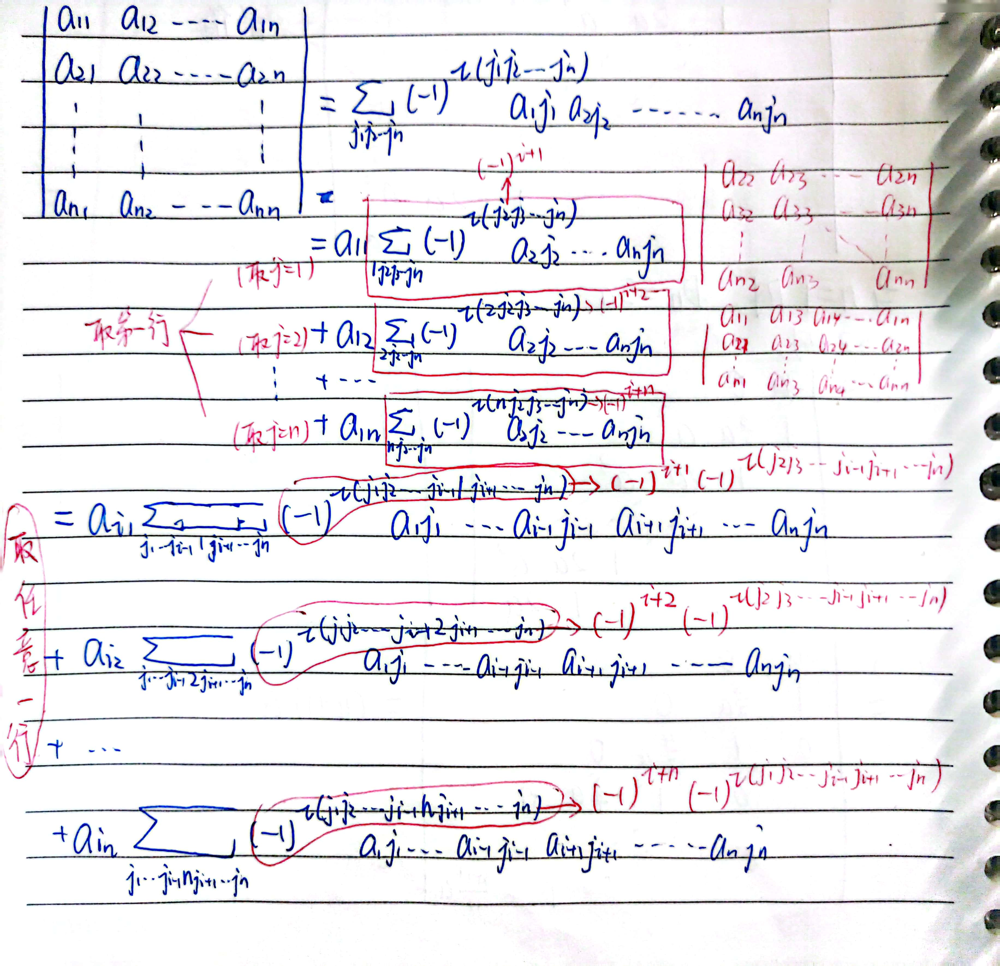

# $\S 1.2$ 行列式
## 一、二阶行列式
$$
\begin{align}
\begin{cases}
a_{11}x+a_{12}y=b_1\\
a_{21}x+a_{22}y=b_2
\end{cases}, 不妨设 a_{11}\ne 0
\end{align}
$$

$$
\begin{align*}
\left[\begin{array}{rr:r}
a_{11} & a_{12} & b_1\\
a_{21} & a_{22} & b_2\\
\end{array}
\right]
\xrightarrow[]{r_1\times (-\frac{a_{21}}{a_{11}})+r_2}
\left[\begin{array}{rr:r}
a_{11} & a_{12} & b_1\\
0 & a_{22}-\dfrac{a_{12}a_{21}}{a_{11}} & b_2-b_1\dfrac{a_{21}}{a_{11}}\\
\end{array}
\right]\\
\xrightarrow[]{r_2\times a_{11}}
\left[\begin{array}{rr:r}
a_{11} & a_{12} & b_1\\
0 & a_{11}a_{22}-a_{12}a_{21} & a_{11}b_2-a_{21}b_1\\
\end{array}
\right]
\end{align*}
$$

当 $a_{11}a_{22}-a_{12}a_{21}\ne 0$ 时，有唯一解 $\begin{cases}x=\dfrac{b_1a_{22}-b_2a_{12}}{a_{11}a_{22}-a_{12}a_{21}}=\dfrac{\begin{vmatrix}
b_1 & a_{12}\\
b_2 & a_{22}
\end{vmatrix}}{\begin{vmatrix}
a_{11} & a_{12}\\
a_{21} & a_{22}
\end{vmatrix}}\\y=\dfrac{a_{11}b_2-a_{21}b_1}{a_{11}a_{22}-a_{12}a_{21}}=\dfrac{\begin{vmatrix}
a_{11} & b_1\\
a_{21} & b_2
\end{vmatrix}}{\begin{vmatrix}
a_{11} & a_{12}\\
a_{21} & a_{22}
\end{vmatrix}}\end{cases}$

* 定义：二阶行列式 $\begin{vmatrix}a & b\\c & d\end{vmatrix}=ad-bc$
## 二、三阶行列式
$$
\begin{align}
\begin{cases}
a_{11}x+a_{12}y+a_{13}z=b_1\quad(1)\\
a_{21}x+a_{22}y+a_{23}z=b_2\quad(2)\\
a_{31}x+a_{32}y+a_{33}z=b_3\quad(3)
\end{cases}, 不妨设 a_{11}\ne 0
\end{align}
$$

$$
\xrightarrow[(2)\times a_{11}-(1)\times a_{21}]{(3)\times a_{11}-(1)\times a_{31}}
\begin{cases}
(a_{22}a_{11}-a_{12}a_{21})y+(a_{23}a_{11}-a_{13}a_{21})z=b_2a_{11}-b_1a_{21}\\
(a_{32}a_{11}-a_{12}a_{31})y+(a_{33}a_{11}-a_{13}a_{31})z=b_3a_{11}-b_1a_{31}
\end{cases}
$$

当 $\Delta=\left | \begin{matrix}
a_{22}a_{11}-a_{12}a_{21} & a_{23}a_{11}-a_{13}a_{21} \\
a_{32}a_{11}-a_{12}a_{31} & a_{33}a_{11}-a_{13}a_{31} \\
\end{matrix} \right |=a_{11}(a_{11}a_{22}a_{33}+a_{13}a_{21}a_{32}+a_{12}a_{23}a_{31}-a_{13}a_{22}a_{31}-a_{12}a_{21}a_{33}-a_{11}a_{23}a_{32})\ne 0$ 时，有唯一解

$$
\begin{cases}
x=\dfrac{\left | \begin{matrix}b_1 & a_{12} & a_{13} \\b_2 & a_{22} & a_{23} \\b_3 & a_{32} & a_{33}\end{matrix} \right |}{\left | \begin{matrix}a_{11} & a_{12} & a_{13} \\a_{21} & a_{22} & a_{23} \\a_{31} & a_{32} & a_{33}\end{matrix} \right |}\\
y=\dfrac{\left | \begin{matrix}a_{11} & b_1 & a_{13} \\a_{21} & b_2 & a_{23} \\a_{31} & b_3 & a_{33}\end{matrix} \right |}{\left | \begin{matrix}a_{11} & a_{12} & a_{13} \\a_{21} & a_{22} & a_{23} \\a_{31} & a_{32} & a_{33}\end{matrix} \right |}\\
z=\dfrac{\left | \begin{matrix}a_{11} & a_{12} & b_1 \\a_{21} & a_{22} & b_2 \\a_{31} & a_{32} & b_3\end{matrix} \right |}{\left | \begin{matrix}a_{11} & a_{12} & a_{13} \\a_{21} & a_{22} & a_{23} \\a_{31} & a_{32} & a_{33}\end{matrix} \right |}
\end{cases}
$$

* 定义：三阶行列式 $\begin{vmatrix}a_{11} & a_{12} & a_{13}\\a_{21} & a_{22} & a_{23}\\a_{31} & a_{32} & a_{33}\end{vmatrix}=a_{11}a_{22}a_{33}+a_{13}a_{21}a_{32}+a_{12}a_{23}a_{31}-a_{13}a_{22}a_{31}-a_{12}a_{21}a_{33}-a_{11}a_{23}a_{32}$

注意：
1. 这种规则适用于n个变量、n个未知量且解唯一的情形
2. 四阶以上行列式规则复杂得多
## 三、排列与逆序
* 排列：由 $1,2,\cdots,n$ 组成的有序数组称为一个 $n$ 阶排列，记为 $j_1,j_2,\cdots,j_n$ 共计 $n!$ 种排法
* 逆序：在 $j_1,j_2,\cdots,j_n$ 中，若大数在小数前面，则这两个数构成一个**逆序**，逆序总数称为**逆序数**，记作 $\tau(j_1j_2\cdots j_n)$
    * 如：$\tau(12345)=0$，$\tau(23541)=5$
    * 若 $\tau(j_1j_2\cdots j_n)$ 为奇数，则称 $j_1j_2\cdots j_n$ 为奇排列；若 $\tau(j_1j_2\cdots j_n)$ 为偶数，则称 $j_1j_2\cdots j_n$ 为偶排列
* **对换一次改变排列的奇偶性**

    证明：考虑相邻情形
    $$
    ....ij.... \leftrightarrow ....ji....(i\leftrightarrow j)
    $$
    逆序数+1或-1，

    一般情形
    $$
    ....ik_1\cdots k_s j.... \leftrightarrow ....jk_1\cdots k_s i....
    $$
    将 $i$ 右移 $s$ 次，$j$ 左移 $s+1$ 次得到，共对换 $2s+1$ 次，奇偶性相反

    * 推论1 奇排列经奇数次对换变为自然排列，偶排列经偶数次对换变为自然排列
    * 推论2 在全部的 $n$ 阶排列中，奇排列个数=偶排列个数

        证明：设共有 $s$ 个奇排列，$t$ 个偶排列。

        将所有奇排列的前两个元素对换，得到 $s$ 个偶排列。

        已知 $s\le t$，同理 $t\le s$

        $\therefore s=t=\dfrac{1}{2}n!$

## 四、n阶行列式
定义
$$
\left | \begin{matrix}
  a_{11}& a_{12}& \cdots  & a_{1n} \\
  a_{21}& a_{22}& \cdots  & a_{2n} \\
  \vdots & \vdots & \ddots & \vdots \\
  a_{n1}& a_{n2}& \cdots  & a_{nn}
\end{matrix} \right |=\sum_{j_1j_2\cdots j_n}(-1)^{\tau{(j_1j_2\cdots j_n)}}a_1j_1a_2j_2\cdots a_nj_n
$$

注：

1. $n$ 阶行列式是 $n!$ 项的代数和
2. 每一项的成绩来自于不同行，不同列
3. 当行标为自然排列 $1234\cdots (n-1)n$ 时，该项符号取决于列标的逆序数。若为奇数，则为负号；若为偶数，则为正号
4. $n$ 阶行列式本质是一个映射
    $$
    f:M_n(K)\rightarrow K
    $$

### 例题
1. 写出四阶行列式中含 $a_{13}$ 和 $a_{32}$ 的项并确定符号

    解：

    $a_{13}a_{21}a_{32}a_{44}$，$\tau(3124)=2(+)$

    $-a_{13}a_{24}a_{32}a_{41}$，$\tau(3421)=5(-)$
2. 写出 $f(x)=\left | \begin{matrix}x & 1 & 1 & 2 \\1 & x & 1 & -1 \\3 & 2 & x & 4 \\1 & 1 & 2x & 1 \end{matrix} \right |$ 中 $x^3$ 的系数

    解：$x^3-8x^3=-7x^3$，$-7$
3. 计算

    $$
    \begin{align*}
    \begin{vmatrix}
      a_{11} & * & * & *\\
       & a_{22} & * & *\\
       &  & \ddots & *\\
       & & & a_{nn}
    \end{vmatrix}=\begin{vmatrix}
      a_{11} &  &  & \\
      * & a_{22} &  & \\
      * & * & \ddots & \\
      * & * & * & a_{nn}
    \end{vmatrix} =a_{11}a_{22}\cdots a_{nn}
    \end{align*}
    $$

4. 计算

    $$
    \begin{align*}
    \begin{vmatrix}
      a_{11} & a_{12} & a_{13} & a_{14} & a_{15}\\
      a_{21} & a_{22} & a_{23} & a_{24} & a_{25}\\
      a_{31} & a_{32} & 0 & 0 & 0\\
      a_{41} & a_{42} & 0 & 0 & 0 \\
      a_{51} & a_{52} & 0 & 0 & 0
    \end{vmatrix}=0
    \end{align*}
    $$

5. 计算

    $$
    \begin{align*}
    I=\begin{vmatrix}
    a_1 & b_1\\
     & a_2 & b_2 \\
    & & a_3 & b_3\\
    & & & \ddots & \ddots \\
    & & & & a_{n-1} & b_{n-1}\\
    b_n & & & & & a_n
    \end{vmatrix}
    \end{align*}
    $$

    解：当 $n=1$ 时，$I=|a_1|=a_1$（不是绝对值）

    当 $n\ge 2$ 时，取 $j_1=1,j_2=2,\cdots,j_n=n$，$a_1a_2\cdots a_n(-1)^{\tau(123\cdots n)}=a_1a_2\cdots a_n$；取 $j_1=2,j_2=3,\cdots,j_{n-1}=n,j_n=1$，$b_1b_2\cdots b_n(-1)^{\tau(234\cdots n1)}=b_1b_2\cdots b_n(-1)^{n-1}$

    故 $I=a_1a_2\cdots a_n+(-1)^{n-1}b_1b_2\cdots b_n$

## 五、行列式的性质
1. 行列式中某行为零，行列式的值为零
2. 行列式中行列互换，其值不变
    * 对行成立的性质，对列也成立

        证明：设 $|A|=\begin{vmatrix}  a_{11} & \cdots & a_{n1} \\  \vdots & \ddots & \vdots \\  a_{1n} & \cdots & a_{nn} \end{vmatrix}$

        在某一项中，行标逆序与列表逆序总和不变

        根据行列式定义得

        $$
        \begin{align*}
        上式&=\sum_{j_1j_2\cdots j_n}(-1)^{\tau(j_1j_2\cdots j_n)}a_1j_1a_2j_2\cdots a_nj_n\\
        &=\sum_{i_1i_2\cdots i_nj_1j_2\cdots j_n}(-1)^{\tau(i_1i_2\cdots i_n)+\tau(j_1j_2\cdots j_n)}a_{{i_1}}j_1a_{{i_2}}j_2\cdots a_{{i_n}}j_n\\
        &=\sum_{i_1i_2\cdots i_n}(-1)^{\tau(i_1i_2\cdots i_n)}a_{i_11}a_{i_22}a_{i_33}\cdots a_{i_nn}\\
        &=\begin{vmatrix}  a_{11} & \cdots & a_{n1} \\  \vdots & \ddots & \vdots \\  a_{1n} & \cdots & a_{nn} \end{vmatrix}=|A|
        \end{align*}
        $$
3. 行列式中，某行（列）有公因子 $k$，可以提到行列式外

    $$
    \begin{align*}
    \begin{vmatrix}
      a_{11} & \cdots & a_{1n} \\
      \vdots & \vdots & \vdots \\
      ka_{i1} & \cdots & ka_{in} \\
      \vdots & \vdots & \vdots \\
      a_{n1} & \cdots & a_{nn}
    \end{vmatrix} &= \sum_{j_1j_2\cdots j_n}(-1)^{\tau(j_1j_2\cdots j_n)}a_1j_1a_2j_2\cdots (ka_ij_i)\cdots a_nj_n\\
    &=k\sum_{j_1j_2\cdots j_n}(-1)^{\tau(j_1j_2\cdots j_n)}a_1j_1a_2j_2\cdots a_ij_i\cdots a_nj_n\\
    &=k\begin{vmatrix}
      a_{11} & \cdots & a_{1n} \\
      \vdots & \vdots & \vdots \\
      a_{i1} & \cdots & a_{in} \\
      \vdots & \vdots & \vdots \\
      a_{n1} & \cdots & a_{nn}
    \end{vmatrix}
    \end{align*}
    $$

4. 加法规则

    $$
    \begin{align*}
    \begin{vmatrix}
      a_{11} & \cdots & a_{1n} \\
      \vdots & \vdots & \vdots \\
      a_{i1}+b_{i1} & \cdots & a_{in}+b_{in} \\
      \vdots & \vdots & \vdots \\
      a_{n1} & \cdots & a_{nn}
    \end{vmatrix} &= \begin{vmatrix}
      a_{11} & \cdots & a_{1n} \\
      \vdots & \vdots & \vdots \\
      a_{i1} & \cdots & a_{in} \\
      \vdots & \vdots & \vdots \\
      a_{n1} & \cdots & a_{nn}
    \end{vmatrix} + \begin{vmatrix}
      a_{11} & \cdots & a_{1n} \\
      \vdots & \vdots & \vdots \\
      b_{i1} & \cdots & b_{in} \\
      \vdots & \vdots & \vdots \\
      a_{n1} & \cdots & a_{nn}
    \end{vmatrix}
    \end{align*}
    $$

5. **对换行列式中的两行（列），其值变为原来的相反数**

    推论：
    * 行列式中两行相同，值为零
        $$
        \begin{align*}
        |A|=-|A|\Rightarrow |A|=0
        \end{align*}
        $$

    * 行列式中两行对应成比例，值为零
        $$
        \begin{align*}
        |A|=k|A|\Rightarrow |A|=0
        \end{align*}
        $$

6. **某行（列）乘以常数加到其他行上，值不变**
### 例题I
1. 计算

    $$
    \begin{align*}
    \begin{vmatrix}1 & 2 & -2 & 3 \\ -1 & -2 & 4 & -2 \\ 0 & 1 & 2 & -1 \\ 2 & 3 & -3 & 10 \end{vmatrix} &= \begin{vmatrix}1 & 2 & -2 & 3 \\ 0 & 0 & 2 & 1 \\ 0 & 1 & 2 & -1 \\ 2 & 3 & -3 & 10 \end{vmatrix}\quad(r_1\times 1 + r_2)\\
    &= \begin{vmatrix}1 & 2 & -2 & 3 \\ 0 & 0 & 2 & 1 \\ 0 & 1 & 2 & -1 \\ 0 & -1 & 1 & 4 \end{vmatrix}\quad(r_1\times (-2) + r_4)\\
    &=\begin{vmatrix}1 & 2 & -2 & 3 \\ 0 & 0 & 2 & 1 \\ 0 & 1 & 2 & -1 \\ 0 & 0 & 3 & 3 \end{vmatrix}\quad(r_3 + r_4)\\
    &=3\begin{vmatrix}1 & 2 & -2 & 3 \\ 0 & 0 & 2 & 1 \\ 0 & 1 & 2 & -1 \\ 0 & 0 & 1 & 1 \end{vmatrix}\quad(r_3 + r_4)\\
    &=\begin{vmatrix}1 & 2 & -5 & 3 \\ 0 & 0 & 1 & 1 \\ 0 & 1 & -3 & 1 \\ 0 & 0 & 0 & 1 \end{vmatrix}\quad((-1)\times c_4+c_3)\\
    &=3\times (-1)^{\tau(1324)}=-3
    \end{align*}
    $$

2. $\begin{vmatrix}  a_1+b_1 & b_1+c_1 & c_1+a_1 \\  a_2+b_2 & b_2+c_2 & c_2+a_2 \\ a_3+b_3 & b_3+c_3 & c_3+a_3\end{vmatrix} = m\begin{vmatrix} a_1 & b_1 & c_1 \\  a_2 & b_2 & c_2 \\ a_3 & b_3 & c_3 \end{vmatrix}$，求 $m$ 的值

    解：
    $$
    \begin{align*}
    左&=\begin{vmatrix}a_1 & b_1+c_1 & c_1+a_1\\
    a_2 & b_2+c_2 & c_2+a_2\\
    a_3 & b_3+c_3 & c_3+a_3\end{vmatrix}+\begin{vmatrix}b_1 & b_1+c_1 & c_1+a_1\\
    b_2 & b_2+c_2 & c_2+a_2\\
    b_3 & b_3+c_3 & c_3+a_3\end{vmatrix}\\
    &=\begin{vmatrix}a_1 & b_1+c_1 & c_1\\
    a_2 & b_2+c_2 & c_2\\
    a_3 & b_3+c_3 & c_3\end{vmatrix}+\begin{vmatrix}b_1 & c_1 & c_1+a_1\\
    b_2 & c_2 & c_2+a_2\\
    b_3 & c_3 & c_3+a_3\end{vmatrix}\\
    &=\begin{vmatrix}a_1 & b_1 & c_1\\
    a_2 & b_2 & c_2\\
    a_3 & b_3 & c_3\end{vmatrix}+\begin{vmatrix}b_1 & c_1 & a_1\\
    b_2 & c_2 & a_2\\
    b_3 & c_3 & a_3\end{vmatrix}\\
    &=2\begin{vmatrix} a_1 & b_1 & c_1 \\
    a_2 & b_2 & c_2 \\
    a_3 & b_3 & c_3 \end{vmatrix}
    \end{align*}
    $$

    $\therefore m=2$

3. 已知 $\begin{vmatrix} a_{11} & a_{12} & a_{13} \\ a_{21} & a_{22} & a_{23} \\ a_{31} & a_{32} & a_{33} \end{vmatrix}=2$，求 $\begin{vmatrix} 3a_{31} & a_{11}+2a_{21} & a_{11} \\ 3a_{32} & a_{12}+2a_{22} & a_{12} \\ 3a_{33} & a_{13}+2a_{23} & a_{13} \end{vmatrix}$ 的值

    解：原式=$6\begin{vmatrix} a_{31} & a_{21} & a_{11} \\ a_{32} & a_{22} & a_{12} \\ a_{33} & a_{23} & a_{13} \end{vmatrix}=-6\begin{vmatrix} a_{11} & a_{12} & a_{13} \\ a_{21} & a_{22} & a_{23} \\ a_{31} & a_{32} & a_{33} \end{vmatrix}=-6\times 2=-12$

4. 计算 $D_n=\begin{vmatrix}a & b & b & \cdots & b\\ b & a & b & \cdots & b\\ b & b & a & \cdots & b\\ \vdots & \vdots & \vdots & \ddots & \vdots\\b & b & b & \cdots & a\end{vmatrix}$

    解：当 $n=1$ 时，$D_n=|a|=a$，

    $n\ge 2$ 时，
    $$
    \begin{align*}
    D_n&=[(n-1)b+a]\begin{vmatrix}1 & 1 & 1 & \cdots & 1\\ b & a & b & \cdots & b\\ b & b & a & \cdots & b\\ \vdots & \vdots & \vdots & \ddots & \vdots\\ b & b & b & \cdots & a\end{vmatrix}\\
    &=[(n-1)b+a]\begin{vmatrix}1 & 1 & 1 & \cdots & 1\\ & a-b & &\\ & & a-b & \\ & & & \ddots\\ & & & & a-b\end{vmatrix}\\
    &=[(n-1)b+a](a-b)^{n-1}
    \end{align*}
    $$

5. $a,b,c$ 为 $x^3+2x-4=0$ 的根，求 $\begin{vmatrix} a & b & c \\ b & c & a \\ c & a & b \end{vmatrix}$

    解：根据已知，$(x-a)(x-b)(x-c)=0$，$-a-b-c=0$，$a+b+c=0$

    原行列式 $=\begin{vmatrix}a+b+c & b & c\\ a+b+c & c & a\\ a+b+c & a & b\end{vmatrix}=0$

6. 求箭形行列式 $\begin{vmatrix}a_0 & b_1 & b_2 & \cdots & b_n\\ c_1 & a_1\\ c_2 & & a_2\\ \vdots & & & \ddots \\ c_n & & & & a_n\end{vmatrix}$ 的值（$a_i\ne 0$，$i=1,2,\cdots ,n$）

    解：思路：消去第一列多余的c

    $$
    \begin{align*}
    原式&=\begin{vmatrix}
    a_0-\dfrac{b_1c_1}{a_1} & b_1 & b_2 & \cdots & b_n\\
    0 & a_1\\
    c_2 & & a_2\\
    \vdots & & & \ddots\\
    c_n & & & & a_n
    \end{vmatrix}\\
    &=\cdots\\
    &=\begin{vmatrix}
    a_0-\dfrac{b_1c_1}{a_1}-\dfrac{b_2c_2}{a_2}-\cdots-\dfrac{b_nc_n}{a_n} & 0 & 0 & \cdots & 0\\
    0 & a_1 \\
    0 & & a_2 \\
    \vdots & & & \ddots\\
    0 & & & & a_n
    \end{vmatrix}\\
    &=(a_0-\sum_{i=1}^n\dfrac{b_ic_i}{a_i})a_1a_2\cdots a_n
    \end{align*}
    $$

7. 证明：奇数阶反对称行列式值为0

    证：根据反对称矩阵的性质有 $A^T=-A$

    $$
    |A|=|A^T|=|-A|=(-1)^n|A|=-|A|
    $$

    由于 $n$ 为奇数，所以 $|A|=0$

8. 求n阶行列式 $\begin{vmatrix}2a & a^2\\ 1 & 2a & a^2\\ & 1 & 2a & a^2\\ & & \ddots & \ddots & \ddots \\ & & & 1 & 2a & a^2\\ & & & & 1 & 2a\end{vmatrix}$ 的值

解：当 $n=1$ 时，$D_n=2a$。

$n\ge 2$ 时，
$$
\begin{align*}
原式&=\begin{vmatrix}
2a & 0\\
1 & \dfrac{3}{2}a & a^2\\
 & 1 & 2a & a^2\\
 & & \ddots & \ddots & \ddots \\
 & & & 1 & 2a & a^2\\
 & & & & 1& 2a
\end{vmatrix}\\
&=\begin{vmatrix}
2a & 0\\
1 & \dfrac{3}{2}a & 0\\
 & 1 & \dfrac{4}{3}a & a^2\\
 & & \ddots & \ddots & \ddots \\
 & & & 1 & 2a & a^2\\
 & & & & 1& 2a
\end{vmatrix}\\
&=\cdots\\
&=\begin{vmatrix}
2a & 0\\
1 & \dfrac{3}{2}a & 0\\
 & 1 & \dfrac{4}{3}a & 0\\
 & & \ddots & \ddots \\
 & & & 1& \dfrac{n+1}{n}a
\end{vmatrix}
&=(n+1)a^n
\end{align*}
$$

### 代数余子式和余子式
三阶行列式按行按列展开：
$$
\begin{align*}
\begin{vmatrix} a_{11} & a_{12} & a_{13} \\ a_{21} & a_{22} & a_{23} \\ a_{31} & a_{32} & a_{33} \end{vmatrix}&=a_{11}a_{22}a_{33}+a_{12}a_{23}a_{31}+a_{13}a_{21}a_{32}-a_{13}a_{22}a_{31}-a_{12}a_{21}a_{33}-a_{11}a_{23}a_{32}\\
&=a_{11}(a_{22}a_{33}-a_{23}a_{32})+a_{12}(a_{23}a_{31}-a_{21}a_{33})+a_{13}(a_{21}a_{32}-a_{22}a_{31})\\
&=a_{11}\begin{vmatrix} a_{22} & a_{23} \\ a_{32} & a_{33} \end{vmatrix}-a_{12}\begin{vmatrix} a_{21} & a_{23} \\ a_{31} & a_{33} \end{vmatrix} + a_{13}\begin{vmatrix}a_{21} & a_{22} \\ a_{31} & a_{32} \end{vmatrix}
\end{align*}
$$

引入：代数余子式和余子式
* $n$ 阶行列式中，划掉第 $i$ 行第 $j$ 列，剩下的 $(n-1)^2$ 个元素按原来的次序构成的 $(n-1)$ 阶行列式，称为第 $i$ 行第 $j$ 列元素的余子式 $M_{ij}$
* 称 $(-1)^{i+j}M_{ij}$ 为其代数余子式，记作 $A_{ij}$
* 因此，行列式既可按行展开，也可按列展开
    * 按第 $i$ 行展开：$|A|=a_{i1}A_{i1}+a_{i2}A_{i2}+\cdots+a_{in}A_{in}$
    * 按第 $j$ 列展开：$|A|=a_{1j}A_{1j}+a_{2j}A_{2j}+\cdots+a_{nj}A_{nj}$
### 例题II
1. $D=\begin{vmatrix}1 & 2 & 0 & 1\\ 1 & 3 & 1 & -1 \\ -1 & 0 & 2 & 1\\ 3 & -1 & 0 & 1\end{vmatrix}$，求 $A_{11}$、$A_{12}$、$A_{13}$

    解：$A_{11}=(-1)^{1+1}\times 1\times \begin{vmatrix}3 & 1 & -1\\0 & 2 & 1\\ -1 & 0 & 1\end{vmatrix}=\begin{vmatrix}3 & 3 & 0\\0 & 2 & 1\\-1 & 0 & 1\end{vmatrix}=3\begin{vmatrix}1 & 1 & 0\\0 & 2 & 1\\-1 & 0 & 1\end{vmatrix}=3 \begin{vmatrix}1 & 1 & 0\\0 & 2 & 1\\0 & 1 & 1\end{vmatrix}=3\times 1\begin{vmatrix}2 & 1\\1 & 1\end{vmatrix}=3\times(2\times 1-1\times 1)=3$

    $A_{12}=(-1)^{1+2}\times 2\times \begin{vmatrix}1 & 1 & -1\\-1 & 2 & 1\\3 & 0 & 1\end{vmatrix}=-\begin{vmatrix}1 & 1 & -1\\0 & 3 & 0\\4 & 1 & 0\end{vmatrix}=-(-1)^{1+3}\times(-1)\begin{vmatrix}0 & 3\\4 & 1\end{vmatrix}=-12$

    $A_{13}=0\times (-1)^{1+3}\times \begin{vmatrix}1 & 3 & -1\\-1 & 0 & 1\\3 & -1 & 1\end{vmatrix}=0$

2. 计算 $\begin{vmatrix}1 & 2 & 0 & 1\\ 1 & 3 & 1 & -1 \\ -1 & 0 & 2 & 1\\ 3 & -1 & 0 & 1\end{vmatrix}$

    解：
    $$
    \begin{align*}
    原式&=\begin{vmatrix}
    1 & 0 & 0 & 0\\
    1 & 1 & 1 & -2\\
    -1 & 2 & 2 & 2\\
    3 & -7 & 0 & -2
    \end{vmatrix}\\
    &=1\times(-1)^{1+1}\begin{vmatrix}
    1 & 1 & -2\\
    2 & 2 & 2\\
    -7 & 0 & -2
    \end{vmatrix}\\
    &=\begin{vmatrix}
    3 & 3 & 0\\
    2 & 2 & 2\\
    -5 & 2 & 0
    \end{vmatrix}\\
    &=2\times(-1)^{2+3}\begin{vmatrix}
    3 & 3\\
    -5 &2
    \end{vmatrix}\\
    &=-2\times[6-(-15)]=-42
    \end{align*}
    $$

3. 计算 $\begin{vmatrix}5 & 3 & -1 & 2 & 0\\ 1 & 7 & 2 & 5 & 2 \\ 0 & -2 & 3 & 1 & 0\\ 0 & -4 & -1 & 4 & 0\\ 0 & 2 & 3 & 5 & 0\end{vmatrix}$

    解：
    $$
    \begin{align*}
    原式&=2\times(-1)^{2+5}\times\begin{vmatrix}
    5 & 3 & -1 & 2\\
    0 & -2 & 3 & 1\\
    0 & -4 & -1 & 4\\
    0 & 2 & 3 & 5
    \end{vmatrix}\\
    &=-2\times 5\times (-1)^{1+1}\begin{vmatrix}
    -2 & 3 & 1\\
    -4 & 1 & 4\\
    2 & 3 & 5
    \end{vmatrix}\\
    &=-10\times\begin{vmatrix}
    -1 & \dfrac{13}{4} & 1\\
    0 & 0 & 4\\
    7 & \dfrac{17}{4} & 5
    \end{vmatrix}\\
    &=-10\times 4\times(-1)^{2+3}\begin{vmatrix}
    -1 & \dfrac{13}{4}\\
    7 & \dfrac{17}{4}
    \end{vmatrix}\\
    &=40(-1\times\dfrac{17}{4}-\dfrac{13}{4}\times 7)\\
    &=-1080
    \end{align*}
    $$

4. 计算 $\begin{vmatrix}a & b\\ & a & b \\ & & \ddots & \ddots \\ & & & a & b\\ b & & & & a\end{vmatrix}_n$

    解：
    $$
    \begin{align*}
    原式&=a \begin{vmatrix}
    a & b\\
    & a & b\\
    & & \ddots & \ddots\\
    & & & a & b\\
    & & & & a
    \end{vmatrix}_{n-1}+ b(-1)^{n+1}\begin{vmatrix}
    b\\
    a & b\\
    & a & b\\
    & & \ddots & \ddots\\
    & & & a & b
    \end{vmatrix}_{n-1}\\
    &=a^n+(-1)^{n+1}b^n
    \end{align*}
    $$

5. 计算 $D_n=\begin{vmatrix}\alpha+\beta & \alpha\beta \\ 1 & \alpha+\beta & \alpha\beta \\ & 1 & \alpha+\beta & \alpha\beta \\ & & \ddots & \ddots & \ddots \\ & & & 1 & \alpha+\beta &\alpha\beta \\ & & & & 1 & \alpha+\beta \end{vmatrix}$

    解：
    $$
    \begin{align*}
    原式&=(\alpha+\beta)D_{n-1}-\alpha\beta \begin{vmatrix}
    1 & \alpha\beta \\
      & \alpha+\beta & \alpha\beta\\
      & 1 & \alpha+\beta & \alpha\beta\\
      & & \ddots & \ddots \\
      & & & 1 & \alpha+\beta
    \end{vmatrix}_{n-1}\\
    &=(\alpha+\beta)D_{n-1}-\alpha\beta D_{n-2}
    \end{align*}
    $$

    $D_1=\alpha+\beta$，$D_2=\alpha^2+\alpha\beta+\beta^2$

    当 $n\ge 3$ 时，$D_n-\alpha D_{n-1}=\beta(D_{n-1}-\alpha D_{n-2})=\beta^{n-2}(D_2-\alpha D_1)$

    $\beta =0$ 时，$D_n=\alpha D_{n-1}=\alpha^{n-1}D_1=\alpha^n$

    $\beta \ne 0$ 且 $\alpha=\beta$ 时，$\dfrac{D_n}{\beta^n}-\dfrac{D_{n-1}}{\beta^{n-1}}=1$，$\dfrac{D_n}{\beta^n}=\dfrac{D_1}{\beta}+(n-1)$，$D_n=(n+1)\beta^n$

    $\alpha \ne \beta$ 时，$\dfrac{D_n}{\beta^n}=\dfrac{\alpha}{\beta}\cdot \dfrac{D_{n-1}}{\beta^{n-1}}+1$

    令 $b_n=\dfrac{D_n}{\beta^n}$，则 $b_n+A=\dfrac{\alpha}{\beta}(b_{n-1}+A)$，$A=\dfrac{\beta}{\alpha-\beta}$

    $$
    \begin{align*}
    \dfrac{D_n}{\beta^n}&=(\dfrac{D_1}{\beta}+\dfrac{\beta}{\alpha-\beta})(\dfrac{\alpha}{\beta})^{n-1}\\
    &=[\dfrac{\alpha^2}{\beta(\alpha-\beta)}]\cdot (\dfrac{\alpha}{\beta})^{n-1}
    \end{align*}
    $$

    $D_n=\dfrac{\alpha^{n+1}-\beta^{n+1}}{\alpha-\beta}$ 代回 $n=1$，$n=2$，成立

    故 $D_n=\begin{cases}\dfrac{\alpha^{n+1}-\beta^{n+1}}{\alpha-\beta}, \alpha \ne \beta \ne 0\\ (n+1)\beta^n,\alpha=\beta\ne 0\\ \alpha^n,\beta =0\end{cases}$

6. 计算 $D_n=\begin{vmatrix}x & b & b & \cdots & b & b\\ c & x & b & \cdots & b & b\\ c & c & x & \cdots & b & b\\ \vdots & \vdots & \vdots & \ddots & \vdots & \vdots \\ c & c & c & \cdots & x & b\\c & c & c & \cdots & c & x\end{vmatrix}$（$b\ne c$）

    解：
    $$
    \begin{align*}
    原式&=\begin{vmatrix}
    x-c & b & b & \cdots & b\\
    0 & x & b & \cdots & b\\
    0 & c & x & \cdots & b\\
    \vdots & \vdots & \vdots & \ddots & \vdots\\
    0 & c & c & \cdots & x
    \end{vmatrix}+\begin{vmatrix}
    c & b & b & \cdots & b\\
    c & x & b & \cdots & b\\
    c & c & x & \cdots & b\\
    \vdots & \vdots & \vdots & \ddots & \vdots\\
    c & c & c & \cdots & x
    \end{vmatrix}\\
    &=(x-c)D_{n-1}+\begin{vmatrix}
    c & b & b & \cdots & b\\
    0 & x-b & 0 & \cdots & 0\\
    0 & c-b & x-b & \cdots & 0\\
    \vdots & \vdots & \vdots & \ddots & \vdots\\
    0 & c-b & c-b & \cdots & x-b
    \end{vmatrix}\\
    &=(x-c)D_{n-1}+c(x-b)^{n-1}
    \end{align*}
    $$

    由对称性可得 $D_n=(x-b)D_{n-1}+b(x-c)^{n-1}$

    由上两式可得 $D_n=\dfrac{c(x-b)^n-b(x-c)^n}{c-b}$

7. 求范德蒙行列式（Vandermonde determinant）的值，$a_1,a_2,\cdots,a_n\in R$

    解：
    $$
    \begin{align*}
    D_n&=\begin{vmatrix}
    1 & 1 & 1 & \cdots & 1\\
    a_1 & a_2 & a_3 & \cdots & a_n\\
    a_1^2 & a_2^2 & a_3^2 & \cdots & a_n^2\\
    \vdots & \vdots & \vdots &  & \vdots\\
    a_1^{n-1} & a_2^{n-1} & a_3^{n-1} & \cdots & a_n^{n-1}
    \end{vmatrix}\\
    &=\begin{vmatrix}
    1 & 1 & 1 & \cdots & 1\\
    0 & a_2-a_1 & a_3-a_1 & \cdots & a_n-a_1\\
    \vdots & \vdots & \vdots &  & \vdots\\
    0 & a_2^{n-2}-a_1a_2^{n-3} & a_3^{n-2}a_1a_3^{n-3} & \cdots & a_n^{n-2}-a_1a_n^{n-3}\\
    0 & a_2^{n-1}-a_1a_2^{n-2} & a_3^{n-1}a_1a_3^{n-2} & \cdots & a_n^{n-1}-a_1a_n^{n-2}
    \end{vmatrix}\\
    &=\begin{vmatrix}
    a_2-a_1 & a_3-a_1 & \cdots & a_n-a_1\\
    a_2^2-a_1a_2 & a_3^2-a_1a_3 & \cdots & a_n^2-a_1a_n\\
    \vdots & \vdots & & \vdots\\
    a_2^{n-1}-a_1a_2^{n-2} & a_3^{n-1}a_1a_3^{n-2} & \cdots & a_n^{n-1}-a_1a_n^{n-2}
    \end{vmatrix}\\
    &=(a_2-a_1)(a_3-a_1)\cdots(a_n-a_1)\begin{vmatrix}
    1 & 1 & \cdots & 1\\
    a_2 & a_3 & \cdots & a_n\\
    a_2^2 & a_3^2 & \cdots & a_n^2\\
    \vdots & \vdots & & \vdots\\
    a_2^{n-2} & a_3^{n-2} & \cdots & a_n^{n-2}
    \end{vmatrix}_{n-1}\\
    &=(a_2-a_1)(a_3-a_1)\cdots(a_n-a_1)(a_3-a_2)(a_4-a_2)\cdots(a_n-a_2)\begin{vmatrix}
    1 & 1 & \cdots & 1\\
    a_3 & a_4 & \cdots & a_n\\
    a_3^2 & a_4^2 & \cdots & a_n^2\\
    \vdots & \vdots & & \vdots\\
    a_3^{n-3} & a_4^{n-3} & \cdots & a_n^{n-3}
    \end{vmatrix}_{n-2}\\
    &=\prod_{1\le j\lt i\le n}(a_i-a_j)【以此类推】
    \end{align*}
    $$

### 行列式的分拆与恢复
定理：
$$
\begin{align*}
a_{i1}A_{j1}+a_{i2}A_{j2}+\cdots +a_{in}A_{jn}=\begin{cases}
|A| & i=j\\
0 & i\ne j
\end{cases}
\end{align*}
$$
例：$|A|=\begin{vmatrix}1 & 2 & -1 & 3\\ 0 & 2 & 3 & 0\\ 4 & 1 & 0 & 2\\ 1 & 1 & 3 & 0\end{vmatrix}$ 每个元素的代数余子式之和为 $A_{ij}$

* $4A_{11}+A_{12}+2A_{14}=0$【恰好是第三行分拆】
* $A_{11}+A_{12}+2A_{13}-A_{14}=\begin{vmatrix}{\color{Red} 1} & {\color{Red} 1} & {\color{Red} 2} & {\color{Red} {-1}} \\0 & 2 & 3 & 0\\4& 1 & 0 & 2\\1 & 1 & 3 & 0\end{vmatrix}$【用A的系数替换】
* $M_{21}-M_{22}+M_{23}+M_{24}=-A_{21}-A_{22}-A_{23}+A_{24}=\begin{vmatrix}1 & 2 & -1 & 3 \\{\color{Red} {-1}}  & {\color{Red} {-1}} & {\color{Red} {-1}} & {\color{Red} 1} \\4& 1 & 0 & 2\\1 & 1 & 3 & 0\end{vmatrix}$【用A的系数替换】
### Cramer法则
> 注：只能处理方程个数与未知量个数相等的方程
$$
\begin{align}
\begin{cases}\tag{*}
a_{11}x_1+a_{12}x_2+\cdots+a_{1n}x_n&=b_1\\
a_{21}x_1+a_{22}x_2+\cdots+a_{2n}x_n&=b_2\\
\vdots &\vdots \\
a_{m1}x_1+a_{m2}x_2+\cdots+a_{mn}x_n&=b_m\\
\end{cases}
\end{align}
$$

当系数矩阵 $|A|\ne 0$ 时，方程组有唯一解
$$
\begin{align}
\begin{cases}\tag{**}
x_1&=\dfrac{|A_1|}{|A|}\\
x_2&=\dfrac{|A_2|}{|A|}\\
 &\vdots \\
x_n&=\dfrac{|A_n|}{|A|}\\
\end{cases}
\end{align}
$$

注：
1. $|A|=0\Rightarrow$（*）无解或无穷多解
2. 此法则为理论结果，实际用处少

下面证明此法则

设 $A=\begin{bmatrix}  a_{11}& a_{12}& \cdots  & a_{1n} \\  a_{21}& a_{22}& \cdots  & a_{2n} \\  \vdots & \vdots & \ddots & \vdots \\  a_{n1}& a_{n2}& \cdots  & a_{nn}  \end{bmatrix}$，增广矩阵 $\tilde{A}=\left[\begin{array}{rrrr:r}  a_{11}& a_{12}& \cdots  & a_{1n} & b_1 \\  a_{21}& a_{22}& \cdots  & a_{2n} & b_2 \\  \vdots & \vdots & \ddots & \vdots & \vdots \\  a_{n1}& a_{n2}& \cdots  & a_{nn} & b_n \end{array}\right]$，$\tilde{A}$ 可变换为

$$
\left[\begin{array}{rrrrrrr:r}
c_{11} & \cdots & c_{1j_2} & \cdots & c_{1j_r} & \cdots &c_{1n}&d_1\\
0 & \cdots & c_{2j_2} & \cdots & c_{2j_r} & \cdots &c_{2n}&d_2\\
 & \ddots & \vdots &  & \vdots &  &\vdots & \vdots\\
 & & 0 & \cdots & c_{rj_r} & \cdots &c_{rn}&d_r\\
0 & \cdots & 0 & \cdots & 0 & \cdots & 0 &d_{r+1}\\
\end{array}\right]
$$

其中 $c_{11},c_{2j_2},\cdots,c_{rj_r}\ne 0$

设 $J=\left[\begin{array}{rrrrrrr}c_{11} & \cdots & c_{1j_2} & \cdots & c_{1j_r} & \cdots &c_{1n}\\0 & \cdots & c_{2j_2} & \cdots & c_{2j_r} & \cdots &c_{2n}\\& \ddots & \vdots &  & \vdots &  &\vdots\\& & 0 & \cdots & c_{rj_r} & \cdots &c_{rn}\\0 & \cdots & 0 & \cdots & 0 & \cdots & 0\\ \end{array}\right]$

则 $|A|=k|J|$，$k\ne 0$。若 $|A|\ne 0$，则 $|J|\ne 0$

$$
J=\begin{bmatrix}
c_{11} \\
& c_{22} \\
& & \ddots \\
& & & c_{nn}
\end{bmatrix}(c_{11},c_{22},\cdots,c_{nn}\ne 0)
$$

方程组有唯一解。

$|A|=0$ 时，$|J|=0$，有零行，解不唯一

$|A|x_j=|A_j|$，$x_j=\dfrac{|A_j|}{|A|}$
